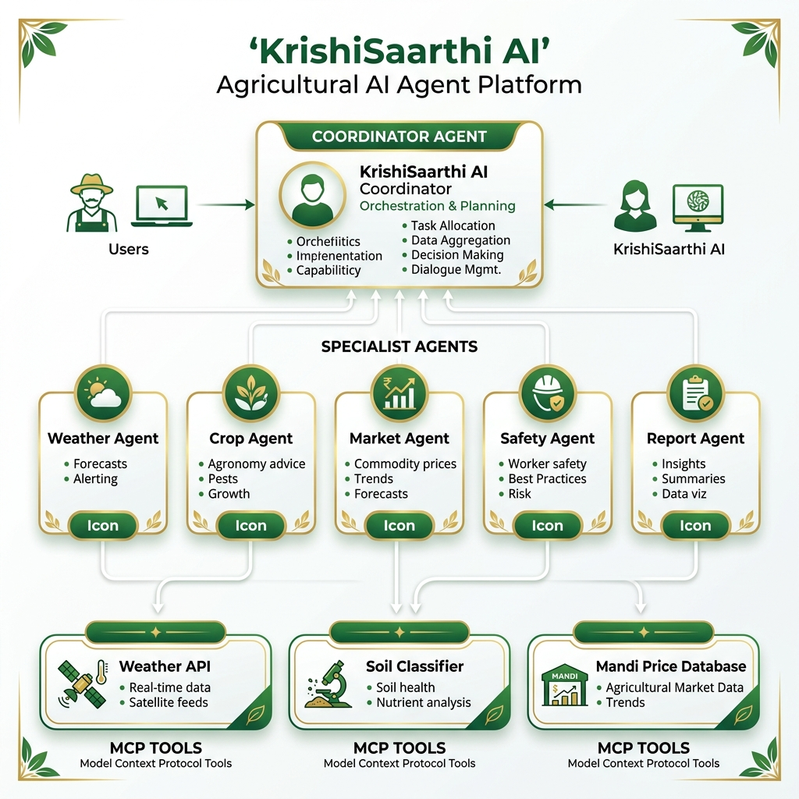
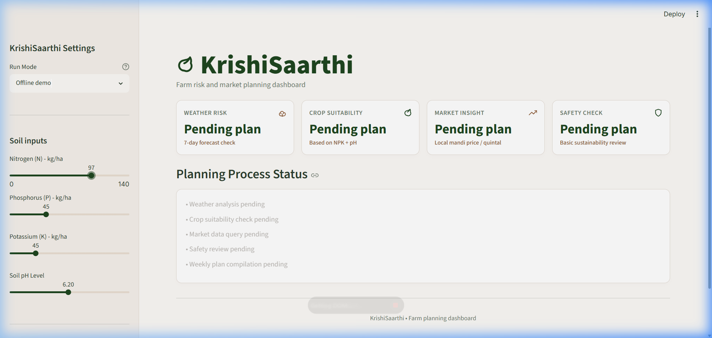
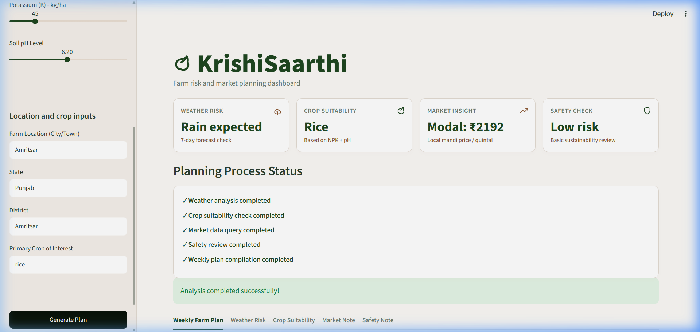
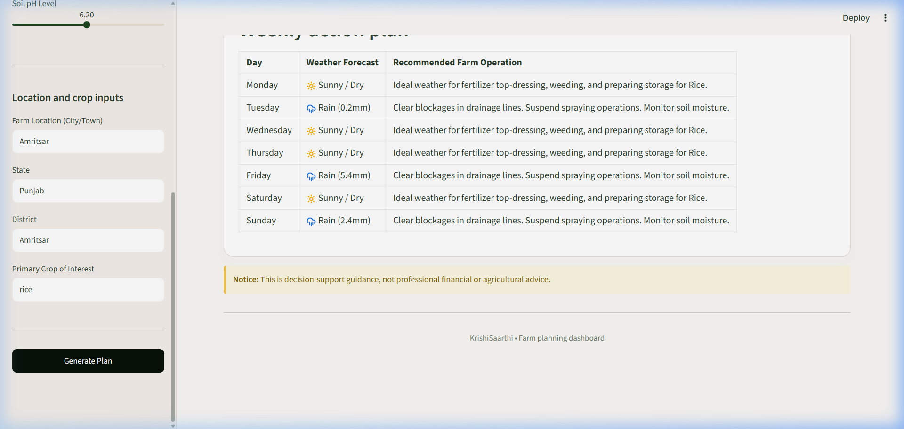
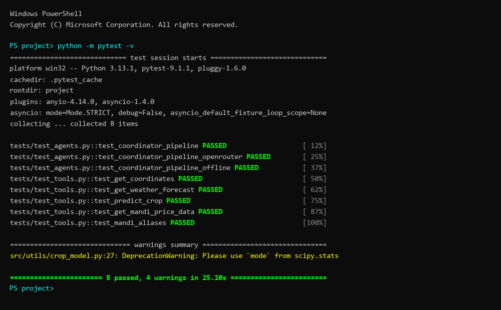

# KrishiSaarthi: Farm risk and market planning dashboard

> Google × Kaggle 5-Day AI Agents Capstone research and vibe-coding project.

---

## Google × Kaggle AI Agents Capstone Project
- **Track**: Agents for Good  
- **Submission Version**: MVP (Model-Context-Protocol & Google ADK Integrated)
- **Repository**: [ANUKOOL324/krishi_saarthi](https://github.com/ANUKOOL324/krishi_saarthi)

---

## 1. Problem Statement

Smallholder farmers (who manage over 80% of agricultural lands in developing regions) operate in high-risk environments with fragmented decision-making channels:
1.  **Weather Hazards**: Unseasonal heavy rains wash out chemical fertilizers, while sudden frosts ruin harvests.
2.  **Soil Nutrients Gaps**: Farmers grow crops without understanding soil nutrient compatibility (Nitrogen, Phosphorus, Potassium, and pH), leading to depleted soils.
3.  **Market Price Gaps**: Regional APMC Mandi prices fluctuate daily. Farmers lack simple, localized tools to identify where and when to sell to optimize margins.

Consulting individual apps or dashboards is complex and time-consuming. **KrishiSaarthi** solves this by uniting weather forecasting, soil-npk suitability models, and regional mandi prices into a safety-audited **Weekly Farm Plan**.

---

## Key Features

- **Multi-Agent Orchestration**: Five specialist AI agents (Weather, Crop, Market, Safety, Report) coordinated sequentially via the Google Agent Development Kit (ADK).
- **MCP Tool Decoupling**: All data retrieval (weather APIs, ML models, databases) exposed as Model Context Protocol tools via a FastMCP server — agents reason, tools fetch.
- **3-Tier Fallback Resilience**: Gemini → OpenRouter → Offline demo mode. The system degrades gracefully and never crashes.
- **ML-Powered Crop Engine**: K-Nearest Neighbors classifier with a pure-Python mathematical fallback when scikit-learn is unavailable.
- **Safety Audit Agent**: Dedicated agent flags excessive chemical use, water-intensive crops in drought zones, and overconfident recommendations.
- **Offline-First Design**: Full planning pipeline works without any API keys or internet connectivity.

---

## 2. Solution Overview & Technical Stack

KrishiSaarthi is an offline-resilient, multi-agent agricultural planner built using:
- **Core Orchestration**: [Google Agent Development Kit (ADK)](https://github.com/google/adk-python) for agent definition and session execution.
- **Model Interface**: **Gemini 2.5 Flash** (via the Google GenAI SDK).
- **Fallback Orchestrator**: **LiteLLM** wrapper pointing to OpenRouter's OpenAI-compatible endpoints to bypass quota rate limits.
- **Reliability Modes**:
  1. **Gemini mode**: The primary execution mode using Google GenAI SDK.
  2. **OpenRouter fallback**: An optional secondary mode utilizing LiteLLM and OpenRouter to bypass rate/quota restrictions.
  3. **Offline demo mode**: A local planning compilation mode that runs without making any external LLM API calls. Recommended for stable demonstrations, screenshots, and video recordings.
- **Tool Protocol**: **Model Context Protocol (MCP)** using Prefect's `FastMCP` framework to decouple tool interfaces from reasoning.
- **Frontend Dashboard**: Streamlit for a glassmorphic agricultural dashboard UI.
- **Machine Learning**: A K-Nearest Neighbors (KNN) crop recommendation classifier built with `scikit-learn` (plus a custom pure-Python mathematical fallback for maximum compatibility).

---

## 3. Multi-Agent Architecture & Coordination Flow

The system employs a sequential **Chain-of-Reasoning** workflow coordinated by the **Coordinator Agent** in [`src/agents/coordinator.py`](src/agents/coordinator.py):

```
                        [ User Input (Soil, Location, Crop) ]
                                          |
                                          v
                              +-----------------------+
                              |   Coordinator Agent   |
                              +-----------+-----------+
                                          |
      +-----------------+-----------------+-----------------+-----------------+
      |                 |                 |                 |                 |
      v                 v                 v                 v                 v
+-----------+     +-----------+     +-----------+     +-----------+     +-----------+
|  Weather  |     |   Crop    |     |  Market   |     |  Safety   |     |  Report   |
|   Agent   |     |   Agent   |     |   Agent   |     |   Agent   |     |   Agent   |
+-----+-----+     +-----+-----+     +-----+-----+     +-----+-----+     +-----+-----+
      |                 |                 |                 |                 |
      | (MCP)           | (MCP)           | (MCP)           | (Audit)         | (Compile)
      v                 v                 v                 v                 v
+-----------+     +-----------+     +-----------+     +-----------+     +-----------+
|get_weather|     | recommend |     | get_mandi |     |Guardrails |     |Weekly Farm|
|   Tool    |     | _crop Tool|     | _price    |     |  Auditor  |     |Action Plan|
+-----------+     +-----------+     +-----------+     +-----------+     +-----------+
```



### Specialist Agents:
1.  **Coordinator Agent**: Receives input parameters, triggers each agent in sequence, and handles context chaining (passing outputs downstream).
2.  **Weather Agent**: Examines weather parameters (from the weather tool) for unseasonal frost, heatwaves, or storm conditions, compiling weekly hazards.
3.  **Crop Agent**: Matches soil chemistry indicators (NPK, pH) to agricultural crop requirements, explaining *why* specific crops are suitable.
4.  **Market Agent**: Queries regional market APMC prices for commodities of interest, pointing out optimal selling ranges and locations.
5.  **Safety Agent**: Audits the recommendations for sustainability, flagging excessive chemical use or water-heavy crops in drought regions.
6.  **Report Agent**: Consolidates intermediate agent inputs into a farmer-friendly Weekly Action Plan, including a Sunday-to-Monday tasks table.

---

## 4. Model Context Protocol (MCP) Tools

We decouple data retrieval from LLM reasoning using three custom MCP tools exposed in [`src/mcp_server.py`](src/mcp_server.py):

1.  **`get_weather(location, days)`**:
    - *Under the hood*: Resolves city names using the Open-Meteo Geocoding API and calls the Open-Meteo Forecast API to pull daily temperature and rain conditions.
    - *Fallback*: If offline or API fails, generates a seasonal weather forecast sequence based on major Indian agricultural zones.
2.  **`recommend_crop(N, P, K, temperature, humidity, ph, rainfall)`**:
    - *Under the hood*: Runs a KNN classifier over our crop suitability dataset (`crop_recommendation.csv`).
    - *Fallback*: If `scikit-learn` is missing, executes a custom distance-similarity KNN module in pure Python.
3.  **`get_mandi_price(commodity, state, district)`**:
    - *Under the hood*: Queries a local database (`mandi_prices.csv`) containing historical pricing averages. Exposes fuzzy matching for crop name aliases (e.g. mapping "chana" to "chickpea") and fallback routing loops if district-specific records are absent.

---

## 5. Security & Credentials Sanitization

- **Zero Hardcoded Secrets**: All code utilizes `dotenv` variables or Streamlit secure key bindings.
- **Git Protections**: `.env` is explicitly ignored inside `.gitignore`.
- **API Key Ingestion**: API keys are handled securely through `.env` or deployment environment variables, with no raw key input fields exposed in the normal UI. An optional developer override expander is available behind a collapsed panel for local iterations, ensuring zero credential exposure in public demos, screenshots, logs, or recorded videos.

---

## 6. Setup & Run Instructions

### Prerequisites
- Python 3.10 to 3.13
- Gemini API Key (Optional if running in Offline Demo Mode)
- OpenRouter API Key & Model (Optional fallback)

### 1. Install Dependencies
```bash
python -m pip install -r requirements.txt
```

### 2. Sample Data (Optional)
Small sample CSV files are included in the `data/` directory. To regenerate with fresh dates:
```bash
python src/utils/generate_data.py
```

### 3. Run FastMCP Tool Server
Launch the MCP server to expose the agronomy tools:
```bash
python src/mcp_server.py
```

### 4. Run Streamlit App
Launch the main user interface dashboard:
```bash
streamlit run app.py
```

### 5. Running the Analysis
- The dashboard defaults to **Offline demo mode** (recommended for recording presentation videos and screenshots to ensure a stable run). No API keys are required for this mode.
- To execute live LLM planning, change the **Run Mode** dropdown in the sidebar to **Gemini mode** (the primary official agent mode) or **OpenRouter fallback** (quota resilience fallback mode) and ensure the corresponding API keys are set in your `.env` file or environment variables. An optional collapsed developer override is also available in the sidebar for temporary test sessions under Technical Settings.

---

## 7. Validation & Test Results

We verify system modules using a dedicated `pytest` suite:
- `tests/test_tools.py`: Tests coordinates geocoding, KNN crop matching, and mandi query alias resolving.
- `tests/test_agents.py`: Simulates the coordinator routing workflow using mocked agents (Gemini ADK runners, LiteLLM completions, and Offline modes).

### Running validation:
```bash
python -m pytest
```
**Output**:
```
collected 8 items

tests\test_agents.py ...                                       [ 37%]
tests\test_tools.py .....                                      [100%]

================== 8 passed, 4 warnings in 14.88s ==================
```

---

## 8. Future Scope & Roadmap

1.  **Voice Interaction & Vernacular Input**: Implementing translation engines and speech-to-text models to support Indian vernaculars (Hindi, Punjabi, Kannada, Marathi).
2.  **IoT Soil Probe Integrations**: Connecting the Streamlit front-end directly to low-cost hardware soil probes (NPK soil sensors) via Bluetooth/Serial.
3.  **Advanced Market Forecasting**: Moving from historical APMC averages to predictive price modeling using seasonal crop supply trends.

---

## 9. Screenshots

| Dashboard Home | Planning Process |
|:-:|:-:|
|  |  |

| Generated Report | Test Results |
|:-:|:-:|
|  |  |
